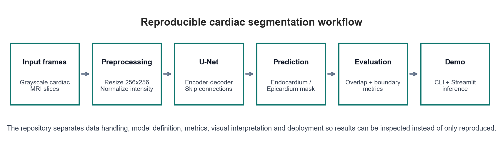
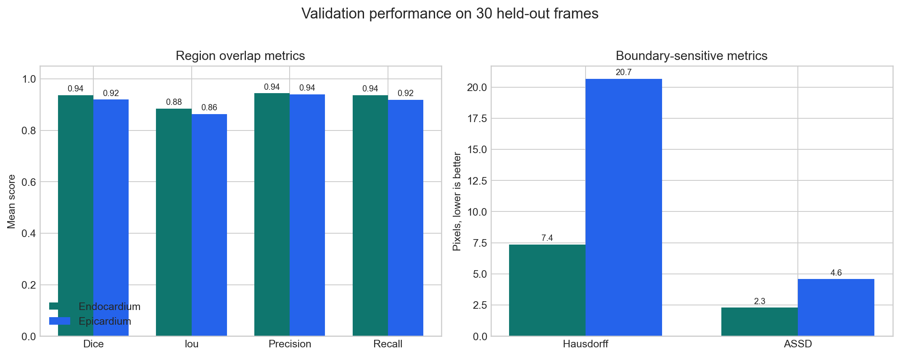
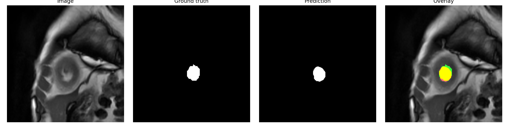
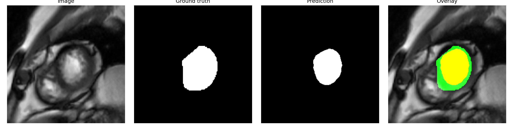
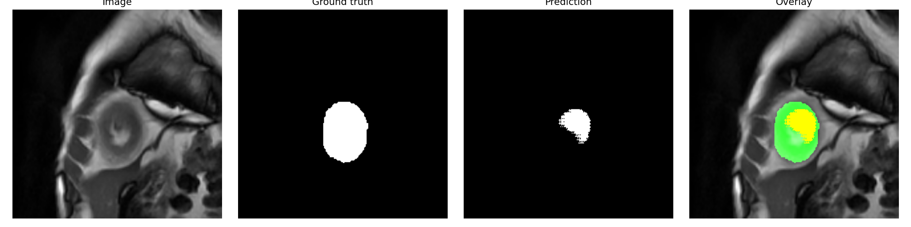
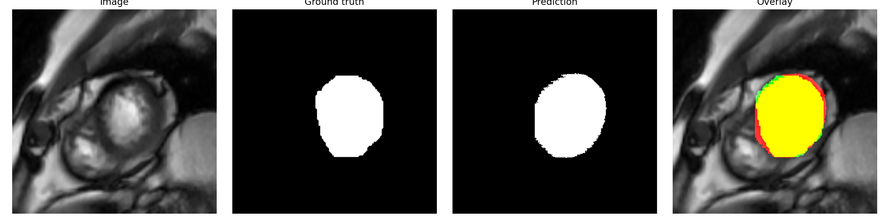

# Cardiac MRI U-Net Segmentation

[](https://blhmarwane.github.io/cardiac-mri-unet-segmentation/)

**A Master TechMed deep-learning project for cardiac MRI contour segmentation, focused on endocardium and epicardium masks, quantitative validation, visual interpretation, and deployable inference.**

This work was developed in the context of my Master TechMed training in biomedical data analysis and deep learning. The project combines machine-learning implementation with clinical context acquired through exchanges with physicians and medical-track peers, especially around anatomical contouring, annotation meaning, and the interpretation of endocardial and epicardial boundaries in cardiac MRI.

> This is an educational and research-oriented medical-imaging project. It is not a medical device or a clinical decision-support system.



## Interactive Project Demo

Open the official interactive result explorer:

[https://blhmarwane.github.io/cardiac-mri-unet-segmentation/](https://blhmarwane.github.io/cardiac-mri-unet-segmentation/)

The demo is a static, reproducible GitHub Pages interface built from the repository validation assets. It lets the reader switch between endocardium and epicardium results, inspect Dice/IoU/precision/recall/Hausdorff/ASSD, compare overlap and boundary behavior, and review representative validation cases with per-image metrics.

## Clinical and Technical Motivation

Cardiac contour segmentation is a central step in quantitative cardiac MRI analysis. Delineating the **endocardium** and **epicardium** makes it possible to estimate ventricular cavity and myocardial wall regions, which are used downstream for functional measurements and anatomical interpretation.

From a machine-learning point of view, this is a useful problem because high overlap scores alone are not enough. A segmentation can have good Dice while still failing locally on anatomical boundaries. For that reason, this project evaluates both:

- **Region overlap**: Dice, IoU, precision, recall.
- **Boundary quality**: Hausdorff distance and ASSD.

This distinction is important in medical imaging: a model should not only "fill roughly the right area", it should also preserve contours in a way that can be inspected and trusted.

## Dataset and Task

The dataset used for validation contains grayscale cardiac MRI frames with paired binary masks. The segmentation targets were studied with attention to their anatomical meaning: the endocardial contour separates the ventricular cavity from the myocardium, while the epicardial contour follows the external myocardial boundary.

| Split | Frames | Endocardium masks | Epicardium masks |
| --- | ---: | ---: | ---: |
| Train | 300 | 300 | 300 |
| Validation | 30 | 30 | 30 |

Two independent binary segmentation tasks are modeled:

- **Endocardium**: inner cardiac contour / cavity boundary.
- **Epicardium**: outer myocardial contour.

The full dataset is not redistributed in this repository because it does not ship with a formal public license. Selected validation panels are included as scientific illustrations of the task, and the repository includes trained checkpoints so the public app can run independently.

## Methodology

The core model is a U-Net encoder-decoder architecture with skip connections. The repository contains:

- a **Keras U-Net implementation** compatible with the trained `.h5` checkpoints;
- a **modern configurable U-Net** variant with batch normalization/dropout options;
- deterministic image-mask pairing by filename;
- grayscale normalization and resize to `256 x 256`;
- binary mask thresholding at `0.5`;
- reproducible evaluation exports in CSV/JSON.

The implementation is structured as a reproducible experiment: data loading, model construction, evaluation, visualization and deployment each live in their own module. This makes the scientific choices inspectable instead of hidden inside an interactive session.

## Results and Interpretation

Validation was performed on 30 held-out frames using the trained U-Net checkpoints.



| Target | Dice | IoU | Precision | Recall | Hausdorff | ASSD |
| --- | ---: | ---: | ---: | ---: | ---: | ---: |
| Endocardium | 0.9374 | 0.8849 | 0.9442 | 0.9369 | 7.35 | 2.29 |
| Epicardium | 0.9198 | 0.8639 | 0.9406 | 0.9187 | 20.66 | 4.58 |

The endocardium model is the most stable component of the pipeline: its Dice score is close to `0.94`, and its boundary metrics remain comparatively low. This suggests that the learned contour is usually close to the reference mask, not only overlapping it globally.

The epicardium model also reaches strong overlap, with Dice around `0.92`, but the higher Hausdorff distance indicates more boundary variability. This is coherent with the task: the outer myocardial contour is often harder to localize because the transition between myocardium and surrounding tissue can be less contrasted than the inner cavity boundary.

High precision for both targets suggests that the models do not massively over-segment the anatomy. The more informative weakness appears in recall and boundary-sensitive metrics, where local misses or contour shifts become visible.

## Qualitative Analysis

Each panel shows the input frame, ground-truth mask, predicted mask and overlay. In the overlay, agreement appears visually as the model contour aligns with the annotated structure.

### Endocardium





### Epicardium





These examples make the numerical results easier to interpret. Good Dice scores are visible as strong spatial overlap, while the boundary metrics explain why the epicardium task remains more sensitive to local contour deviations.

## Reproducible Research and Deployment

Beyond model training, this project emphasizes reproducibility and communication of biomedical AI results. The repository is organized so that another reader can inspect the data flow, run inference, reproduce evaluation summaries, and understand the limitations of the experiment:

- `src/segmed/`: package for dataset loading, U-Net models, metrics, evaluation and visualization;
- `configs/`: endocardium/epicardium experiment configuration;
- `segmed` CLI: train, evaluate and predict from the terminal;
- `app/streamlit_app.py`: interactive inference prototype;
- `docs/results/`: public validation summaries used by this README;
- `tests/`: unit tests for deterministic metric/config behavior.

This structure reflects the objective of a Master-level biomedical AI project: not only implementing a neural network, but also explaining the clinical target, validating the output, visualizing model behavior, and making the work reviewable.

## Limitations and Next Steps

The current validation set is small (`30` frames), so the results should be interpreted as a controlled project validation rather than a general benchmark. The next scientific step is external validation on a public benchmark such as Sunnybrook or ACDC, with patient-level splits and stronger reporting of outliers.

Other planned improvements:

- compare the checkpoint-compatible U-Net against the modern U-Net configuration;
- add uncertainty or confidence maps for visual quality control;
- report per-image worst cases and failure modes;
- add a public benchmark loader once licensing and format assumptions are explicit.

## Quick Start

```bash
python3 -m venv .venv
source .venv/bin/activate
pip install -e ".[dev]"
```

Evaluate the public endocardium checkpoint:

```bash
segmed evaluate \
  --config configs/endo.yaml \
  --weights models/endo_unet.h5 \
  --split Val
```

Run the local Streamlit app:

```bash
streamlit run app/streamlit_app.py
```

For this local preparation folder only, if the path contains special characters such as `#`, use:

```bash
PYTHONPATH=src python -m segmed.cli evaluate \
  --config configs/endo.yaml \
  --weights models/endo_unet.h5 \
  --split Val
```

## Repository Notes

Full local datasets, training outputs, TensorBoard logs and scratch artifacts are ignored by Git. The included model checkpoints and selected visual panels are used to make the scientific workflow understandable and demo-ready without redistributing the full dataset.
